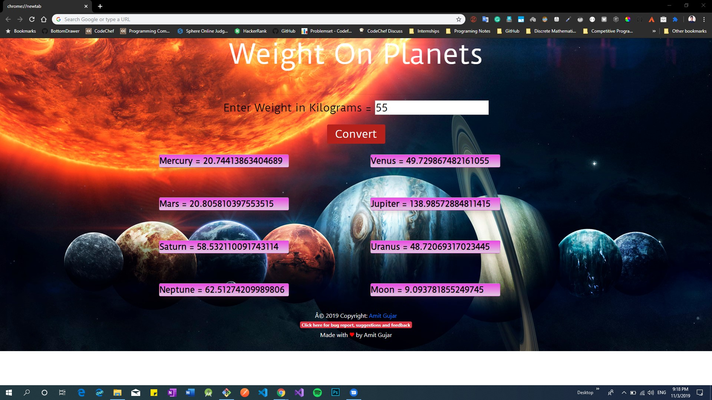

# Weight On Planets (Chrome Extension)
### As name explains weight on planets is a new tab extension which helpful to you in finding your weight in different planets in our solar system.
# Screenshot

## Programming languages and Tools
1. Vanilla JavaScript
2. Visual Studio Code

## Getting Started

### Clone the repository locally 
1. Clone the repository to your machine : `git clone https://github.com/AmitGujar/WeightOnPlanets-Chrome-Extension`

### Enable Extensions Developer Mode on Google Chrome/ chromium browser
1. Navigate to [chrome://extensions/](chrome://extensions/).
2. Enable developer mode (Toggle button in right top corner).
3. Select `Load Unpacked` and browse and select the cloned repository folder.
4. Make sure that the extension is enabled.
5. Open a new tab in Chrome and you should see a calculator screen.

##  License
MIT License

Copyright (c) 2019 Amit Dilip Gujar

Permission is hereby granted, free of charge, to any person obtaining a copy
of this software and associated documentation files (the "Software"), to deal
in the Software without restriction, including without limitation the rights
to use, copy, modify, merge, publish, distribute, sublicense, and/or sell
copies of the Software, and to permit persons to whom the Software is
furnished to do so, subject to the following conditions:

The above copyright notice and this permission notice shall be included in all
copies or substantial portions of the Software.

THE SOFTWARE IS PROVIDED "AS IS", WITHOUT WARRANTY OF ANY KIND, EXPRESS OR
IMPLIED, INCLUDING BUT NOT LIMITED TO THE WARRANTIES OF MERCHANTABILITY,
FITNESS FOR A PARTICULAR PURPOSE AND NONINFRINGEMENT. IN NO EVENT SHALL THE
AUTHORS OR COPYRIGHT HOLDERS BE LIABLE FOR ANY CLAIM, DAMAGES OR OTHER
LIABILITY, WHETHER IN AN ACTION OF CONTRACT, TORT OR OTHERWISE, ARISING FROM,
OUT OF OR IN CONNECTION WITH THE SOFTWARE OR THE USE OR OTHER DEALINGS IN THE
SOFTWARE.
